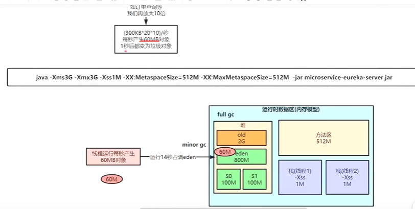

# java

- **arthas** (https://arthas.aliyun.com/doc/)

- 为什么java jvm设计STW

  - > 

### tools

- x

### JDK JRE JVM

### == and equals

- == 对比的是栈中的值，
  - 如果是基本数据类型则对比的是变量值
  - 如果是引用类型则对比的是内存对象的地址
- equals
  - object中默认采用==比较
  - String类中重写equals，只对比值

### final

内部类如果要使用外部变量，则外部变量必须要用final修饰

### String StringBuffer StringBuilder

